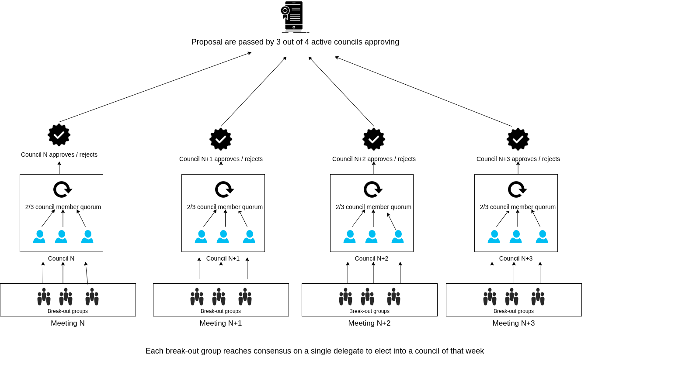

# Eden+Fractal

## Definitions

## Mechanism

1. During Respect game each break-out room in addition to electing  dele

1. Each break-out room after determining rankings for weekly contributions tries to reach consensus on a delegate to elect (it can be different from the top contributor);
3. Delegates from each break-out room together constitute a council for that week;
4. Each council serves for 4 weeks (this means that at any point in time fractal has 4 councils);
5. Councils from different weeks may have the same people in them;
6. Council is said to "approve a proposal" when at least 2/3rds of its members vote to approve it, during the hour before the break-out room session;
7. Proposal is passed once at least 3 out of 4 active councils approve it, during the hour before the break-out room session;

## Sources
* [Specification published on Hive](https://peakd.com/fractally/@sim31/edenfractal-consensus-process)
* [Historical info](https://edencreators.com/plus)