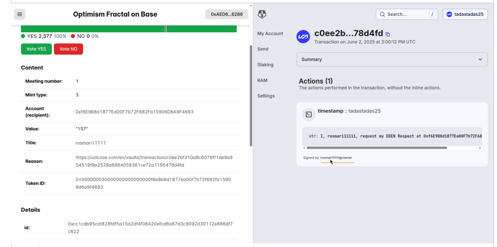

# Eden Fractal claim interface
Problem:

* Eden Fractal Respect exists on EOS. We are trying to move it to Base; 
* EOS uses different account system, so we need to map EOS accounts of Eden Fractal users to EVM addresses;
* Then we need to mint Respect token on Base;

## Challenges
* Keypairs controlling EOS accounts can change;
* There might be a missmatch between onchain distribution of Respect on EOS and community consensus on what this distribution should be, because Respect was not distributed for some Respect game sessions in EF;
* Some might have lost access to their accounts;
* Some might have earned Respect to 2 EOS accounts;

## Solution
To address these challenges we use an oracle, controlled by human participants, who have already proved their reputation in fractal governance on the Superchain. Specifically the oracle will be an [Orec smart contract](https://github.com/sim31/ordao/blob/1cf15452b137c16d847b925d229d9ff86eadd56a/docs/OREC.md) controlled by Respect distribution of Optimism Fractal seasons 1-4. You can see this distribution onchain [here](https://optimism.blockscout.com/token/0x53C9E3a44B08E7ECF3E8882996A500eb06c0C5CC?tab=holders). This distribution is deployed on Base [here](https://basescan.org/address/0xe4b4013b6d7de55f86ff24a1406b85a4dfa591ff).

Eden Fractal participants will submit a signed statement on EOS, saying that they request their Eden Fractal Respect to specific EVM account. Then, an Orec proposal will be created to mint appropriate amount of Respect on Base.

A stepwise claiming process would look like this:

1. User logs in with EOS account (the one he used while participating in Eden Fractal Epoch 1);
2. User specifies account he wishes to receive Eden Fractal Respect on Base;
3. User signs and submits a transaction to EOS blockchain which contains data: "I, `eosaccount`, request my EDEN Respect at `eth-address`";
4. Then an orec proposal is created to mint Respect on Base
    1. If user has ETH for gas on Base then he himself creates a proposal;
    2. If user does not have a gas on Base then he shares a link to transaction he submitted on Base with people who can submit it for him ([telegram group](https://t.me/edenfractal/5191) has been created for this purpose);

### Claim request submission
Request which is submitted on EOS will be submitted to eos account `tadastadas25`, contract action `timestamp`, with argument str:"I, `eosaccount`, request my EDEN Respect at `eth-address`".

Code of this action does nothing. What we care about is that argument passed to it is recorded on EOS mainnet. Full code of `tadastadas25` smart contract is here: https://github.com/sim31/timeos .

A link to this transaction can then be used as evidence in Orec proposal that the claim is valid. Example link to transaction: https://unicove.com/en/vaulta/transaction/98e1e3ae4ce0e5f29f928eef8e477713de4b301046707c78f49d937952a2d71b

More info about an Orec deployment which will act as an oracle: [concept.md](./concept.md).

### Proposal to mint Respect
[Typical ORDAO proposal](https://orclient-docs.frapps.xyz/classes/ORClient.html#proposeRespectTo) to mint Respect to an account will be used as a proposal to issue Eden Fractal Respect on Base. However to help organize and display proposals and resulting Respect awards, the following convention should be followed:
* Award title should be EOS account which earned that Respect in Epoch 1;
* Award reason should be a block explorer link to [request transaction](#request-on-eos) on EOS.

These details are only important for oracle and frontend should take care of formating proposals according to these conventions.

### Oracle participant checklist
As a member of an oracle (any member of Optimism Fractal who wants to help perform these oracle functions) you should usually check the following before voting on most proposals to mint Respect (for Eden Fractal Epoch 1):

1. Open link to block explorer referenced in "Reason" field and check that the signed statement matches the details in the proposal:

2. Check that the transaction is signed by the account referenced in the "Title" field of proposal

2.1.

2.2.

3. Check that the amount being minted matches the "EDEN" balance on EOS

3.1.

3.2.

3.3.

### Requirements for Eden Fractal Epoch 2
It is recommended for Eden Fractal Epoch 2 ORDAO deployment to have `voting_period + veto_period` be at least twice as long as `voting_period + veto_period` of [Optimism Fractal on Base Orec deployment](./concept.md) (currently 6 days). This is to allow Eden Fractal members to participate in Eden Fractal Epoch 2 proposals even if they haven't claimed before these proposals were created (so that they still have time to vote after receiving their Epoch 1 Respect). Fortunately biweekly meeting structure should create a suitable environment for this.
