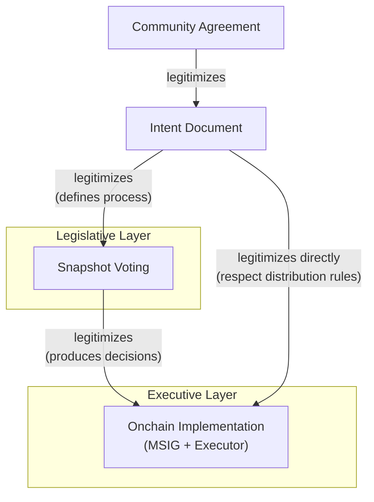
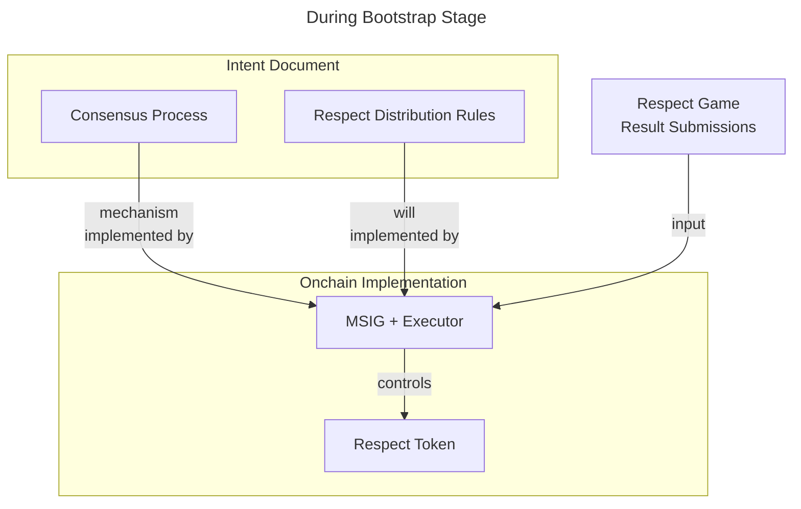
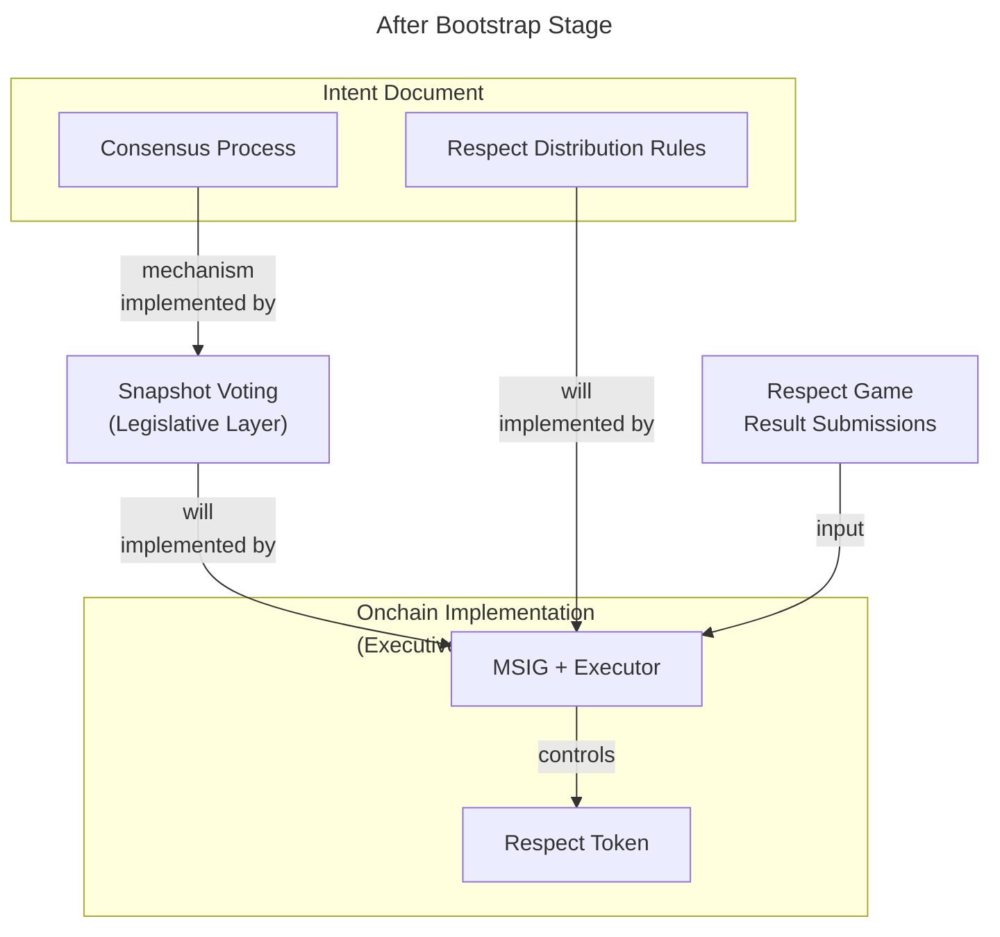

# ORDAO History

[ORDAO](../apps/orfrapps/ordao/) is a toolset. As with any tool there are different ways of using it and some ways might work better than others. Additionally context matters - a tool might work better in some contexts than in others. Furthermore a tool might be better suited for solving certain sets of problems than others.

Beyond just proper use of ORDAO as a tool, how it developed is also relevant since it can inform understanding of design decisions and limitations of ORDAO and inform future development patterns for the kind of communities ORDAO was created to serve.

The purpose of this document is to shine a light on ORDAO usage and development patterns that work by providing a clear history of how ORDAO developed and how it has successfully been used so far. Hopefully this will provide useful context for future developments or ORDAO or alternative codebases.

## ORDAO origins

ORDAO was initially created to solve specific problems for one specific community - [Optimism Fractal](./optimism-fractal/). Optimism Fractal was created by participants of [Eden Fractal Epoch 1](./eden-fractal-1/) by replicating their [EOS](https://en.wikipedia.org/wiki/EOS.IO)-based Eden Fractal process on Optimism and presenting it to Optimism community. ORDAO was meant to solve problems a lot of which Optimism Fractal inherited from Eden Fractal Epoch 1. Hence we have to start with Eden Fractal Epoch 1 in order to understand the origins, context and design patterns of ORDAO.

### ORDAO grandparent - Eden Fractal Epoch 1 toolset

The relevant part of Eden Fractal Epoch 1 for us here is the process through which in-meeting [respect game](../concepts/respect-game.md) results were submitted onchain and produced an onchain [respect](../concepts/respect.md) distribution. Three components were at play here

* [Fractalgram](./eden-fractal-1/index.md#fractalgram-from-meeting-35) - an app where participants played [respect game](../concepts/respect-game.md) ([fractalgram mode](../concepts/fractalgram.md));
* [Submission frontend](./eden-fractal-1/index.md#consensus-submissions-frontend) - an app through which participants submitted respect game results to the smart contracts;
* [EOS Smart contract](./eden-fractal-1/index.md#smart-contracts) which collected respect game results and implemented [Respect](../concepts/respect.md) token;

**Respect game submissions did not automatically produce a respect distribution.** The Respect distribution was controled by a multisignature setup consisting of members of the community. Every mint of Respect had to be confirmed by this multisig. The respect game result submissions served only as a signal based on which an msig proposal was created and later executed.

So overall process went like this:
1. Community plays respect game in meeting using [fractalgram](./eden-fractal-1/index.md#fractalgram-from-meeting-35)
2. At the end of the game fractalgram generates a link to the submission frontend in which respect game results (from a single breakout room) are encoded (e.g.: `https://edenfracfront.web.app/?delegate=tadas25&groupnumber=1&vote1=tadas25&vote2=dan&vote3=rosmari&vote4=vlad`);
3. Participants of a breakout room go to that link, click a submit button, which initiates a transaction which records their submission of the results (the user effectively signs respect game results from his breakout room and the signature is recorded onchain);
4. Someone [^1] checks all the submissions from the respect game event and creates an msig proposal to distribute Respect accordingly ([using fibonnaci starting with 5](./eden-fractal-1/meeting-str-1-18.md)).
5. Participants of the msig review and confirm an msig proposal;
6. MSIG proposal is executed;

There were obvious flaws with this approach. Primarily that manual effort was needed to distribute respect and collect signatures. That sometimes lead to late distributions and in the end to [some failures to distribute](https://www.notion.so/edencreators/Respect-Distribution-Considerations-for-Epoch-2-1fb074f5adac80a8aceccfa41773804d?source=copy_link#1ff074f5adac80f8bad1ef4cc89b1105) altogether. But it worked for most of epoch 1 and most importantly it was transparrent process (there's an onchain record of all respect submissions and the whole respect distribution can be checked against that). It also had an added benefit of flexibility when it came to implementing the intent of respect game session - in case of failures by participants to submit or in case of conflicting submissions, we were able to figure out the true intent of participants after the meeting and create the appropriate msig proposals. This would not have been possible with any kind of completely automated respect distribution system.

### ORDAO parent - Optimsim Fractal 1st generation toolset

In summer of 2023 group of 4 Eden Fractal participants (team known as [Optimystics](https://optimystics.io/)) started collaborating to bring Respect Games to Optimism. One of the motivations was potential synergy between respect game and [RetroPGF](https://retropgfhub.com/) as both of them are retroactive in nature [^2]. This culminated in the beginning of Optimism Fractal in October of 2023 ([around 72nd event of Eden Fractal](https://www.youtube.com/watch?v=ZFoAoZgwx3g&list=PLa5URJF9l5lkX4t8YMZ7wytDZggdXeFor&index=68)).

#### Bootstrap stage
Partly because of the time constraints, partly because of lack of agreement within Optimystics about the design of the next version of a fractal app, the initial version of Optimism Fractal was in a lot of ways a replica of Eden Fractal, just on Optimism. Same [fractalgram](./eden-fractal-1/index.md#fractalgram-from-meeting-35) app was used for playing Respect Game. The [submission frontend](../history/optimism-fractal/index.md#tools--frontends) (for submitting respect game results) was a fork of the [Eden Fractal submission frontend](../history/eden-fractal-1/index.md#consensus-submissions-frontend). The main change was the [smart contract](./optimism-fractal/index.md#meetings-1---48) since it had to be an EVM smart contract to work on Optimism (Eden Fractal worked on EOS). But even the smart contract in a lot of ways mirrored the design of the smart contract on EOS in order to be compatible with other components (submission frontend and fractalgram). It had an [owner](https://docs.openzeppelin.com/contracts/4.x/access-control#ownership-and-ownable), which was 3/4 msig setup consisting of 4 members of Optimystics. The owner could mint and burn Respect as needed.

There was one key change though - executor role. The owner could set an "executor" account, which had a permission to distribute respect once a week, by submitting respect game results. The owner could obviously change the "executor" at any time and basically overide executors actions by burning and re-minting respect. Thus, during normal operation, when executor simply implements the will of community and community agrees with him, we were able to distribute Respect with much less hassle than in Eden Fractal epoch 1, while still having a fallback mechanism controlled by the msig in case something went wrong.

Overall it could be said that the 1st generation of Optimism Fractal software was significant in that it brought respect game to Optimism and to EVM world in general. But it was relatively small step forward when it came the quality of the actual process:
* The executor still had to distribute Respect manually;
* The owner of the smart contract and effectively the whole onchain respect distribution were 4 people who founded Optimism Fractal. The rest of community did not have any onchain control yet;

We understood these key issues when deploying Optimism Fractal and hence looked the initial version as a prototype which we could use to bootstrapping future improvements. At the same time wanted community to have a clear picture on how Optimism Fractal has potential to work without being distracted by the limitations of the current software. Therefore we introduced something we called "intent document" - a short [document that explains how Optimism Fractal was intended to work natural (not too technical) language](../history/optimism-fractal/of-intent-1.pdf). [It](../history/optimism-fractal/of-intent-1.pdf) covered what Optimism Fractal is, what is Respect, what is Respect game and most importantly defined a mapping between respect game results (contributor rankings from each breakout group) and Respect distribution (amount of Respect given to each ranked contributor). This way we were communicating clearly how respect game submissions were supposed to be translated to Respect distribution. Thus even though the actual onchain mechanism used was not fully decentralized and democratized yet, because it depended on an executor and msig of 4 people, it was (and still is) transparent and verifiable - using onchain history you can check if respect was distribued according to democratic and credibly neutral mechanism described in the intent document.

This [original intent document](./optimism-fractal/of-intent-1.pdf) also defined a simple, council-based, consensus process for making changes to any of the rules of Optimism Fractal or its Respect distribution. It then defined a "bootstrap stage" as first 12 events during which the "council" which makes decision in consensus process would be the 4 people who have founded Optimism Fractal. **This meant that, in the beginning, consensus process of Optimism Fractal defined in the intent document and the msig setup which controlled the onchain smart contracts matched each other. In other words, the onchain msig implemented the consensus process defined in the intent document.**

The bootstrap stage made sense not just because it bought us time to develop something better. We wanted eventual consensus process to be based on Respect distribution (one of the main use cases of Respect - bootstrapping governance), but we did not have any respect distribution to start with on Optimism. So some kind of bootstrapping phase to build up the initial distribution was needed.

But this bootstrap stage had a predefined limit - 12 events (12 weeks). This time frame seemed reasonable to us at the time. By then we expected to implement a fully onchain legitimate consensus process that would give all the power to the respect-holders who have been participating throughout the bootstrap stage and beyond.

#### Birth of a legislative process in Optimism Fractal
During the bootstrap stage introducing fractals to Optimism community took a lot of our attention. The 12 week deadline for an onchain upgrade that transfers power to respect-holders turned out to be too optimystic.

To save the legitimacy of Optimism Fractal and to preserve reputation of Optimystics as the first council of Optimism Fractal, we came up with a solution. We passed [a new intent document](./optimism-fractal/of-intent-2.pdf) that defined a new consensus process, that was designed to involve all the respect-holders and work easily enough with the coordination tools we already had - namely snapshot. Basically respect-holders could register to participate in councils and top 6 registered respect-holders would constitute a council for a week that could pass proposals. 

**This still did not give respect-holders any onchain power. But the point is that it gave them a voice and a clear, transparrent mechanism to issue legitimate consensus signals.**

This [new intent document](./optimism-fractal/of-intent-2.pdf) did not even mention msig or any other onchain mechanism. It just dealt in concept of "a council" and a consensus process that elects the council and gives it power to pass proposals. This made the intent document clean from technical language. **And the whole point is that Optimism Fractal is an organization that works according to the intent document. If an onchain implementation, whether using a fixed msig or some other centralized solution, does not implement this intention, then it (by definition) not the implementation of Optimism Fractal (it is not Optimism Fractal). The community should always pick and use an implementation that matches the intent.** This means that through passing this new intent document, Opitmystics did in a sense transfer power to the respect-holders. In case Optimystics msig and its executor role failed to represent the will of respect-holder consensus process defined in the intent document, the community would have to coordinate to get a new onchain implementation going, and that would have required work and coordination. But at this point there was a basis for agreement (the intent document), which would have made this transition significantly easier had such a need arisen.

This can be understood through the concept of a legitimacy chain: each layer of the governance system derives its legitimacy from the layer above it. Community agreement legitimizes the intent document. The intent document legitimizes the legislative layer (the consensus process implementation) by defining the process it must faithfully implement. The legislative layer legitimizes the executive layer (onchain MSIG + Executor) by producing the decisions it must carry out. For respect distribution, the intent document legitimizes the executive layer directly - the rules are specific enough that no per-instance legislative decision is needed. The intent document is therefore the top of the legitimacy chain (below community agreement). Without it, replacing a failing executive layer would require rebuilding community agreement from scratch. With it, the community has a coordination anchor - an agreed-upon basis from which to judge whether lower layers are functioning correctly and to replace them if they are not. Blockchain transparency makes each link in the chain verifiable - anyone can check whether the executive layer faithfully implemented the will of the legislative layer and the intent document by examining the onchain record. Transparency does not create legitimacy, but it makes the legitimacy chain auditable, which is what sustains trust in the system over time.

Passing this intent document was also a significant event from the perspective of [tripartite governance model theory](../concepts/tripartite-governance-model.md). As mentioned before, during the bootstrap stage the onchain mechanism implemented the consensus process defined in the intent document. **After the bootstrap stage the role of the onchain mechanism became to implement *the will* (expected outputs) of the consensus process defined in the intent document rather than to implement the actual mechanism as defined. The implementation of the actual consensus mechanism was in Snapshot at that point.** In other words, what was previously a single consensus process implemented directly by the MSIG now split into two distinct layers: a legislative layer (Snapshot voting, where the community's will is determined) and an executive layer (the onchain MSIG, which carries out that will). When it came to the respect distribution, the onchain implementation always implemented the will of the intent document directly - consensus process did not have to be involved in every respect distribution. 

This split into legislative and executive layers was the birth of a distinct legislative process in Optimism Fractal. The consensus process was no longer fused with its onchain execution - it now had its own independent implementation where the community's will could be formed, while the onchain mechanism was relegated to carrying out that will.

#### Operation of the new legislative process

Through events 12-49 the 1st generation toolset of Optimism Fractal worked in tandem with the new council-based legislative process. Full history of all proposals council passed can be found in [Optimism Fractal's Snapshot space](https://snapshot.org/#/optimismfractal.eth/).

One of the most common uses of the new legislative process was to fix respect distributions when respect game submissions were lacking in some way. This was needed because the [intent documents](./optimism-fractal/index.md#intent-document) during that time contained a clause that required at least 2/3rds of the breakout group to submit the same ranking of contributors for a [respect game](../concepts/respect-game.md) result to be considered "valid" and result in legitimate respect distribution. But it would often happen that some breakout room participants would not submit. They would never express a disagreement with the results. Most often there would either be some technical difficulty (user not having wallet prepared, connection issues, etc) or other coincidental circumstances (them having to leave a bit early, forgetting it, other timely concerns).

This is a general pattern that's very clear from our experiences in online (video call) Respect game sessions: all kinds of issues and distractions happen during these calls. If we had a strict blockchain-based process that would enforce all the rules and deadlines during respect game a big part of Respet would not have been distributed.

So within this strand of fractals (Eden Fractal, Optimism Fractal) our practice historically has been to look for the true intent from the breakout room and use a transparent process for making sure the Respect distribution reflects the true intent. In case of Optimism Fractal this meant using the council process to pass proposals like [this one](https://snapshot.org/#/s:optimismfractal.eth/proposal/0x3895270f9e87c9bd62b3ce30e43023f38f99bd4068b4cc6ff051fe54e52b067d) that would explicitly name the intended respect distribution and then using the "executor role" to execute the intended distribution. There was never any dispute ever raised about ochain respect distribution in Optimism Fractal, which is the clearest argument for the legitimacy of this process.

Besides fixing respect distributions we also used the council process to [change the intent document of Optimism Fractal](./optimism-fractal/intent-changelog.md) or to pass new meeting schedules and scheduling breaks.

### ORDAO seeds

The legislative process described above was started in January 2024. There was one other significant event for ORDAO that happened at the beginning of that year: I published a document titled "OREC" [^3] [^4], that described an early draft version of [OREC](../concepts/orec.md), that later became the essence of ORDAO. Comparing that version with the [current](../apps/orfrapps/ordao/docs/OREC.md#specification), that initial version was very rough - a lot more complicated and less polished. But you can recognize the same approach at solving the same problem. This document was actually published before passing the new legislative process described above. We went with that process, because we did not have an implementation of OREC, nor the agreement that we really want to go that way.

So after a short back and forth discussion about OREC, we kind of forgot about it and then throughout the first quarter of 2024 Optimism Fractal ran the new legislative process as [described above](#operation-of-the-new-legislative-process) while Optimystics internally also tried to agree on the design of a new fractal app. It was very much still needed. Some of the main pain pain points at the time:

* **Manual distribution of Respect** - not only this required manual work from "executor" within Optimism Fractal, but also prevented any realistic replication of our process to other communities - the work executor had to was not something you can ask a non-technical user to do.
* **Ownership of smart contracts and respect distribution by the founders** - we wanted community to become autonomous and self-sufficient (i.e.: transfer onchain control to respect-holders);
* **Issues with Respect token in block explorers** - holders list wasn't working on Etherscan, distribution transaction did not show how much each account received.
* **Respect game submission requirements requiring constant intervention from legislative process** - legislative process had to "fix respect distributions" for breakout groups as described above quite often. This "fixing" was quite straighforward but required some manual work and clear communication. Another thing that would prevent replicability of our process at the time - typical user would expect less work for such a routine procedure.

There was another issue which wasn't a pain point yet, but which we knew would become more relevant as the time went on. Something that could probably be categorized as version of ["incumbency advantage"](https://en.wikipedia.org/wiki/Incumbent#:~:text=%5B3%5D-,Incumbency%20advantage,-In%20general%2C%20an) of fractals. People who have participated a lot in the past but are not active anymore, could have a lot of respect and have a lot of governance power as a result, even though they might have lost touch with the community. It's an interesting discussion topic - how much an organization should give power to those who contributed a lot in the past vs those who are more recent and more active contributors. But generally most agreed that there's utility in some form of decay of respect-based power. You can see one discussion about it [here](https://discord.com/channels/1164572177115398184/1164572177878765591/1194574639255523389).

## Initial development

* Change in approach to a process of development of a fractal app

## Optimism Fractal deployment

[^1]: Dan Singjoy

[^2]: https://optimystics.io/enhancing-retropgf-with-optimism-fractal

[^3]: https://discord.com/channels/1164572177115398184/1164572177878765591/1193866578563977286

[^4]: https://adaptable-oxygen-176.notion.site/OREC-e991e5b8025c4170948b7e20bbfbb2bd
