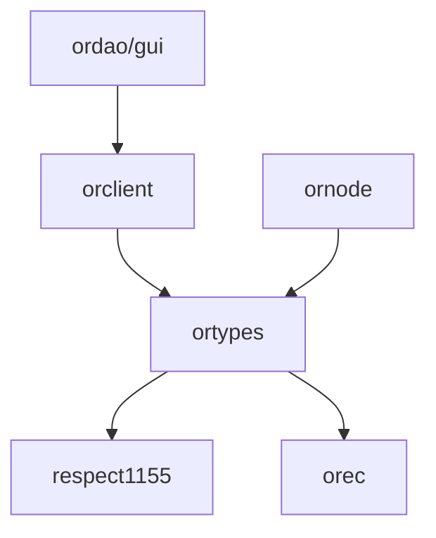

# Frapps codebase
Modules for building [Fractal](https://optimystics.io/blog/fractalhistory) apps.

## Applications
* [Ordao](./ordao/) (Optimistic Respect-based DAO) - a prototype app for a fractal that uses [Optimistic Respect-based executive contract](../concepts/OREC.md) and non-fungible Respect token. [Read here how to use it](./ordao/sys/README.md).

## Modules
<!-- TODO: Add READMEs to subdirs -->
* [ordao/sys](./ordao/sys) - configuration and scripts to develop / test / deploy whole [Ordao](./ordao/) system.
* [ordao/gui](./ordao/gui) - frontend for Optimistic Respect-based DAO (early work in progress);
* [orclient](./orclient/) - a library for Ordao apps / frontends, that abstracts all the communication with the backend and blockchain;
* [ornode](./ornode/) - a NodeJS service to provide availability of data, which is not stored onchain but necessary for Ordao apps;
* [ortypes](./ortypes/) - Typescript types and helper utilities for Ordaos. Defines interfaces between orclient - ornode - contracts.
* [ts-utils](./ts-utils/) - More general typescript utilities;
* [respect1155](./respect1155/sc/) - a non-transferrable reputation token contract based on ERC-1155. [Read more here](./respect1155/sc/README.md);
* [orec](./orec/) - implementation of [OREC concept](../concepts/OREC.md) (in Solidity);

### Dependency graph

