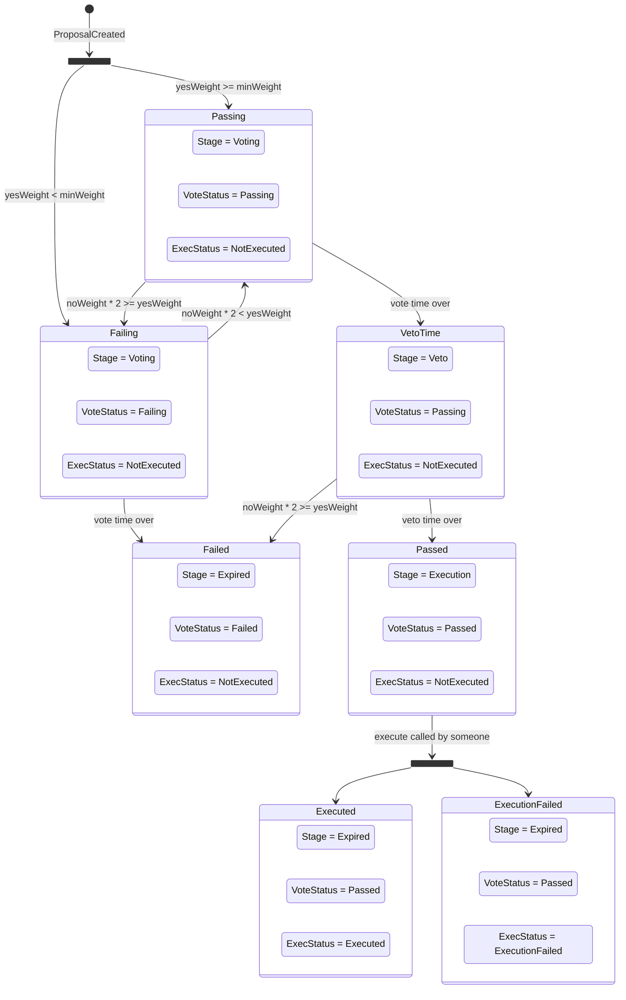

# Optimistic Respect-based Executive Contract (OREC)

[Concept](../../concepts/OREC.md).


```shell
npx hardhat help
npx hardhat test
REPORT_GAS=true npx hardhat test
npx hardhat node
npx hardhat ignition deploy ./ignition/modules/Lock.ts
```

## Lifecycle of Proposal




