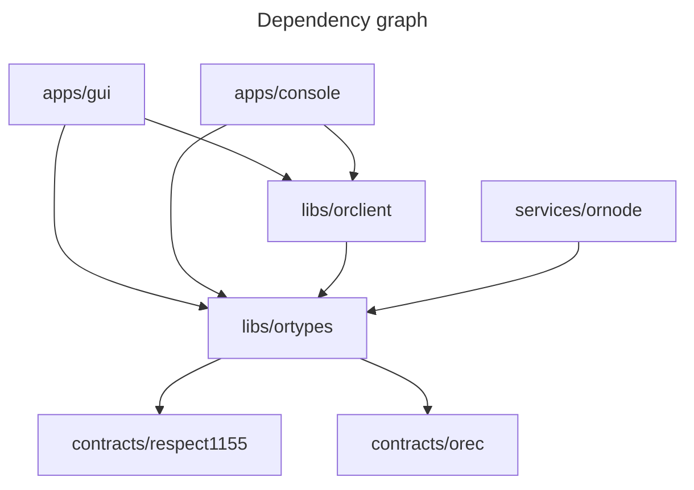

# ORDAO

<!-- TODO: link -->
ORDAO (Optimistic Respect-based DAO) is a toolset for type of DAOs which use non-transferrable reputation token (Respect). Core of ORDAO is [Optimisti Respect-based executive contract (OREC)](./docs/OREC.md), which enables DAOs to execute actions onchain in a democratic way while avoiding [voter-apathy problem](./docs/OREC.md#motivation). Broadly speaking ORDAO is OREC smart contract plus necessary tooling around it (off-chain services, libraries and frontend apps).

More specifically these are currently the main components of ORDAO:

* [Contracts](./contracts/)
  * OREC ([specification](./docs/OREC.md) and [implementation](./contracts/orec/));
  * [Respect1155](./contracts/respect1155/) - Respect token contract based on ERC-1155 standard;
* [Services](./services/)
  * [ornode](./services/ornode/) - API service for storing OREC proposals and Respect token metadata;
* [Libraries for interfacing with OREC](./libs/)
  * [orclient](./libs/orclient/) - A library for Ordao apps / frontends, that abstracts all the communication with the backend and blockchain;
  * [ortypes](./libs/ortypes) - Typescript types and helper utilities for Ordaos. Defines interfaces between orclient - ornode - contracts.
* [Apps](./apps/)
  * [gui](./apps/gui) - ORDAO frontend (currently only breakout-result submission frontend for fractals is implemented);
  * [console](./apps/console/) - documentation plus console interface for orclient (allows you to interface with ORDAO through browser console).

## Relationship to Optimism Fractal
ORDAO came about as an upgrade to Optimism Fractal. [Here](./docs/OF_ORDAO_UPGRADE.md) you can find comparison with older Optimism Fractal software and proposed upgrade path.

