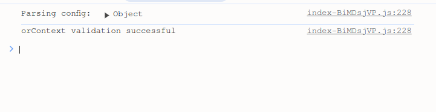
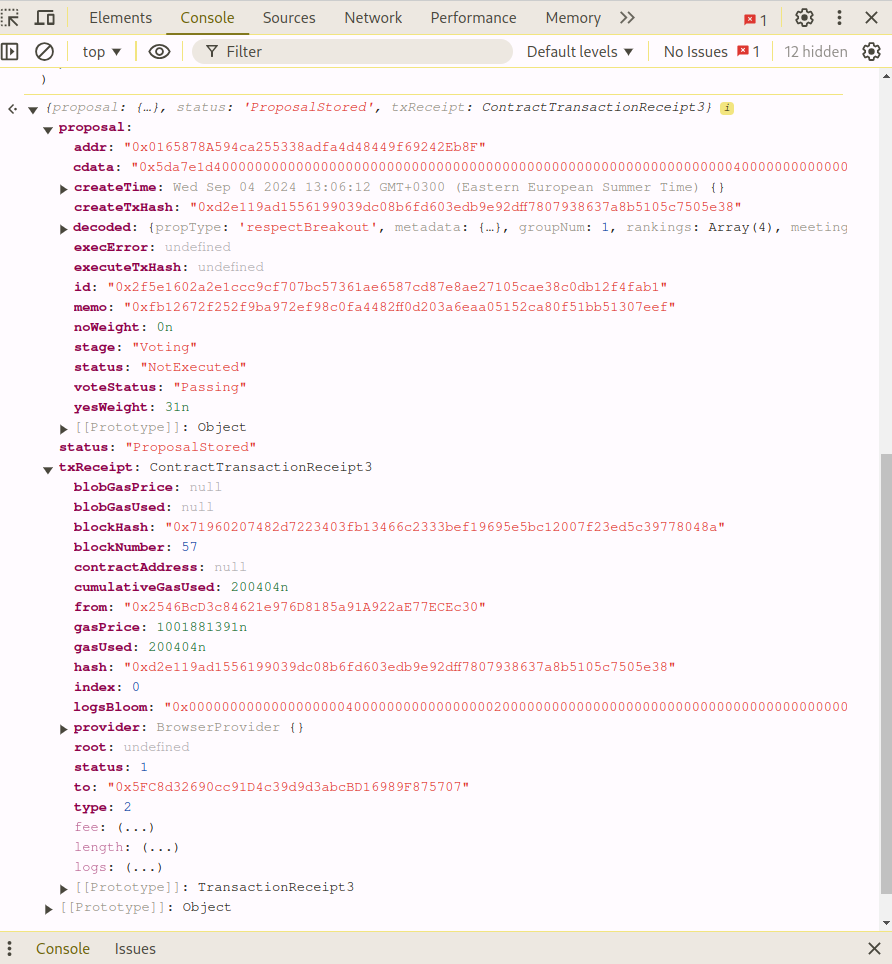

# Ordao Console

This is documentation for [Orclient](https://github.com/sim31/frapps/tree/main/impl/orclient) - library for client-side [ORDAO](https://github.com/sim31/frapps/tree/main/impl/ordao) apps / frontends, that abstracts all the communication with the backend and blockchain.

This page also exposes orclient interface through developer console. On this page if you [open developer console](https://search.brave.com/search?q=how+to+open+developer+console+instructions+in+chrome%2C+firefox%2C+safari%2C+edge%2C+arc&source=web&summary=1&summary_og=51166683b1b99a74551626) you should see something like this in it:

Now, in console, write `c.help()` and press enter. You should see some help text printed back in console. You should also be navigated back to this page, if you navigated somewhere else earlier. **Use `c.help()` command to get back to this page.**

`c.help()` should have printed a list of methods exposed by orclient. To see a documentation with examples for a particular method use `c.<method>.help()` command where `<method>` is the name of one of the methods from the list. For example enter: `c.proposeBreakoutResult.help()`. This will make you jump to section about this method in the documentation. There you should find an example usage of `proposeBreakoutResult` method. Try it. If you are logged in with metamask to the right network and with account that has enough tokens to pay for gas, it should work. After waiting up to 30 seconds you should see an object in console that contains information about executed transaction:

Ordao uses some existing Respect distribution for vote weights. Use `c.getOldRespectOf(<address>)` to get balance of your account.

This page should also have a menu on the left through which you can navigate throughout the documentation as well.

