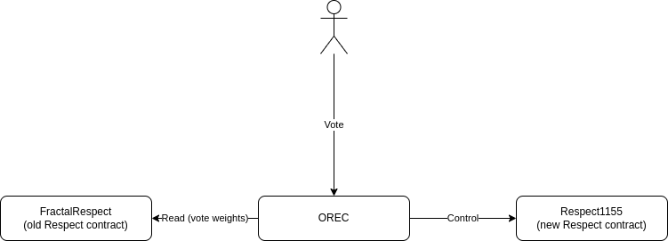

# ORDAO Smart Contracts

<!-- TODO: Would be better for this description to be independent from of2 upgrade path -->

Smart contracts for Optimistic Respect-based DAOs.

* [Orec](./orec) - acts as an [executive contract](../docs/OF2-CONCEPT.md#6-executive-contract) to distribute Respect and execute other transactions for a fractal. It implements Optimistic Respect-based executive contract as specified [here](../docs/OREC.md).
* [Respect1155](./respect1155/) - new [Respect token](../docs/OF2-CONCEPT.md#3-respect) contract, that OREC will use to [distribute Respect](../docs/OF2-CONCEPT.md#4-respect-distribution) going forward (OREC will be set as the owner of this contract);
* [FractalRespect](../../op-fractal-1/op-fractal-sc/contracts/FractalRespect.sol) - this is the [old Respect contract](../docs/OF2-CONCEPT.md#5-parent-respect-token) that will be used to determine vote weights in OREC;

.

Rationale for this design is in [upgrade path description](../docs/UPGRADE_PATH.md).