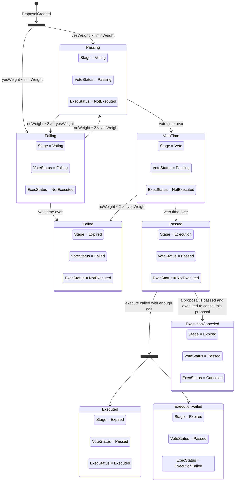

# Optimistic Respect-based Executive Contract (OREC)

[Concept](../../docs/OREC.md).


```shell
npx hardhat help
npx hardhat test
REPORT_GAS=true npx hardhat test
npx hardhat node
npx hardhat ignition deploy ./ignition/modules/Lock.ts
```

## Lifecycle of Proposal



There are some additional states that are possible to reach but are not very likely or useful:

* It is possible to cancel a failed proposal

This will delete the proposal from storage, but unless it's part of some bigger execution context you're not going to save any gas;

* It might be theoretically possible to cancel a proposal that is not yet passed or failed;

1. Construct proposal A but don't submit it onchain;
2. Submit proposal B to cancel proposal A (submit it onchain);
3. Submit proposal A;
4. Pass and execute proposal B to cancel proposal A;
Result: proposal A is canceled (removed) before it reaches execute stage.

But I don't see a vulnerability here.
