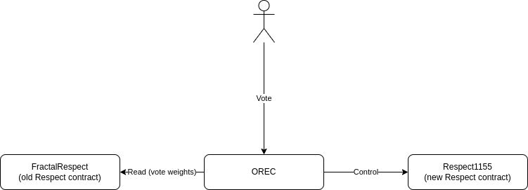

# Optimism Fractal 2

This document describes work being done in this repo to upgrade Optimism Fractal software. 

The working code-name for this new software package is "ORDAO" (optimistic respect-based DAO). 

Scope of the upgrade (components of Optimism Fractal that would be replaced):

* Smart contracts ([current](../../op-fractal-1/op-fractal-sc/));
* Breakout room submission frontend ([current](../../op-fractal-1/op-fractal-frontend/));
* Intent document ([current](../../op-fractal-1/OP_Fractal_Intent_V2.pdf));

## Features

* Ownership of contracts transferred to respect-holders;
* Semi-automated distribution of Respect;
* No need for hard rules about how many submissions from the breakout room is needed;
* Fixes [current problems](https://www.notion.so/edencreators/Improve-representation-of-Respect-on-block-explorers-1201d818ff3a430fa662e4d5e398fb79) with Respect token;
* Enables respect-holders to mint or burn Respect for reasons other than respect game;
  * Enables awarding Respect for use cases other than Respect Game;
  * Allows fixing mistakes in distribution more easily;
  * This is a step towards making it easier to deal with situations where ETH address of a person changes;
* Easier to deal with cases where breakout room submissions need to be corrected;
* [Other advantages of OREC](./OREC.md#orec-approach);

### Ownership of contracts transferred to the current Respect-holders
Current contracts of Optimism Fractal are "owned" by people who started Optimism Fractal. Now that we have a stable Respect-distribution that represents participants of Optimism Fractal, we can transfer control to them.

The control by Respect-holders would be exercised through [Orec (Optimistic Respect-based executive contract)](./OREC.md) - a onchain transaction proposal system that is very flexible in adapting to levels of voter participation onchain.

### Semi-automated distribution of Respect
One of the main issues with the current version is the need for manual distribution of Respect. This looks like a single account issuing transactions to distribute Resepct. This account can be changed by owners of the contract, but it's an issue still both in terms of centralization and amount of manual administrative work required.

ORDAO achieves something I call "semi-automated" distribution of respect. The way it works is that participants submit votes on a proposal to distribute respect and if proposal is passed (according to [Orec rules](./OREC.md#specification)) then proposal enters "execution stage". At that point any account (does not have to be participant of Optimism Fractal) can send a transaction to execute the proposed transaction. The need for this additional transaction to execute the distribution is the only reason it's "semi-automated" and not "automated." But once a good GUI for this app is available this additional action will be as simple as anyone clicking one button and signing transaction with their wallet. This is a big improvement over a current version, where some administrator account has to create transactions "by hand".

The Respect amount to distribute will be automatically calculated by frontend before the user submitting a vote on any proposal to distribute respect. More details [here](#how-will-respect-game-result-in-respect-distribution).

### No need for hard rules about how many submissions from the breakout room is needed
Another pain-point in the current version is the requirement for number of onchain breakout room result submissions. It quite regularly results in [council](../of1/OP_Fractal_Intent_V2.pdf) having to pass [proposals](https://snapshot.org/#/optimismfractal.eth) to distribute Respect for rooms which haven't made enough onchain submissions.

The number of required submissions is quite arbitrary, as not reaching this number does not mean that there's no consensus. The fact that pretty much all council proposals to distribute Respect for rooms that didn't have enough submissions pass, proves that there's often consensus about breakout room results even when there are not enough submissions. But of course we still need security mechanisms to prevent attackers from getting Respect.

Respect distribution should be controlled by a fractal. So consensus of a fractal is more important than consensus of an individual breakout room. So if fractal has consensus that a breakout room should get awarded with Respect, it should be so. 

I propose ditching the arbitrary requirements for number of submissions from a breakout room and instead using a flexible onchain proposal mechanism ([Orec](./OREC.md)), that adapts to levels of onchain participation, to distribute Respect according to consensus of a fractal.

### Fixes current problems with Respect token;
[Respect1155](../contracts/respect1155/) fixes [main headaches](https://www.notion.so/edencreators/Improve-representation-of-Respect-on-block-explorers-1201d818ff3a430fa662e4d5e398fb79) with the current Respect contract of Optimism Fractal. It is ERC1155 contract with a fungible token representing fungible Respect and NTTs with value attribute that sums to balance of a fungible token.

## Concept (intent)

[OF2-CONCEPT document here](./OF2-CONCEPT.md) describes how the proposed version would work. It is a modified version of the [current intent document](../of1/OP_Fractal_Intent_V2.pdf) that Optimism Fractal participants should be familiar with. It serves the same function as the current intent document. It is a human language definition of Optimism Fractal that could be useful to prevent any misunderstandings and contentious forks.

The main change are the addition "Executive contract" section which defines how Optimism Fractal will implement their consensus onchain (distribute Respect, etc) and removal of 3rd section which was about validity of breakout-room results.

[Read full concept here](./OF2-CONCEPT.md).

## Implementation

Work is being done to implement this concept [here](../).

### Smart Contracts

* [Orec](../contracts/orec) - acts as an [executive contract](./OF2-CONCEPT.md#6-executive-contract) (as defined in [concept](#concept-intent)) to distribute Respect and execute other transactions for a fractal. It implements Optimistic Respect-based executive contract as specified [here](./OREC.md).
* [Respect1155](../contracts/respect1155/) - new [Respect token](./OF2-CONCEPT.md#3-respect) contract, that OREC will use to [distribute Respect](./OF2-CONCEPT.md#4-respect-distribution) going forward (OREC will be set as the owner of this contract);
* [FractalRespect](../../op-fractal-1/op-fractal-sc/contracts/FractalRespect.sol) - this is the [old Respect contract](./OF2-CONCEPT.md#5-parent-respect-token) that will be used to determine vote weights in OREC;

.

Rationale for this design is in [upgrade path description](./UPGRADE_PATH.md).

### How will Respect game result in Respect distribution
Frontend will accept breakout room results as always, but then it will translate it to OREC proposal to distribute Respect for break-out room participants (according to their ranking). When the user submits, he will actually be submitting a vote on that OREC proposal. This way an old and familiar Respect game workflow will integrate seamlesly with the new and more powerful OREC mechanism.

### ORConsole
[ORConsole](../apps/console) is a documentation / console app for interacting with ORDAO. It's already working and it's the main tool right now which I use to interact with ORDAO. It exposes all the functionality that will take time to develop in the GUI frontend. You can think of ORConsole as a web-app for the fractal where all the functionalities are available early in a command-line fashion.

Most importantly it provides documentation for the programming API to interact with Ordao which will make it easier for anyone to build a GUI for ORDAO (or at least some of its features).

### GUI
Currently [GUI worked on in this repo](../apps/gui) has only as much as the GUI for the previous version of Optimism Fractal - only a frontend for submitting breakout results is implemented. This is where help would be appreciated.

One option is to grow [gui project](../apps/gui) in this repo. But ORDAO is built with composability in mind, exposing APIs through [orclient](../libs/orclient) which should make it easy to build a GUI from scratch or integrate interactions with ORDAO into other interfaces. [ORConsole is a great tool for learning ORClient](#orconsole).

GUI (and orclient that it uses) can be improved gradually, even after contracts are replaced, so it does not have to slow down the upgrade process as outlines in [upgrade path document](./UPGRADE_PATH.md).

## Upgrade path

The idea is to deploy implementation on Optimism mainnet as a test version that can potentially become the new "official" version of Optimism Fractal, if Optimism Fractal consensus decides so. 

[More details here](./UPGRADE_PATH.md).

*UPDATE: Optimism Fractal passed [a proposal](https://snapshot.org/#/optimismfractal.eth/proposal/0x3c35f474b1e2c037f32455abd75d027aa29d402200ac649fecb8b46c789c26a3) to adopt ORDAO this season. The upgrade path ended up being a bit different. Namely in that it happened for season 5 as opposed to season 4 and there's no overlap between the new and old token distribution so far. See [this thread](https://discord.com/channels/1164572177115398184/1164572177878765591/1298633304383426621) for more details.*

## Feedback
If you have any feedback about this please share it in [Optimism Fractal Discord server](https://discord.gg/dJgrP8ekYC) or create an issue here on Github.

